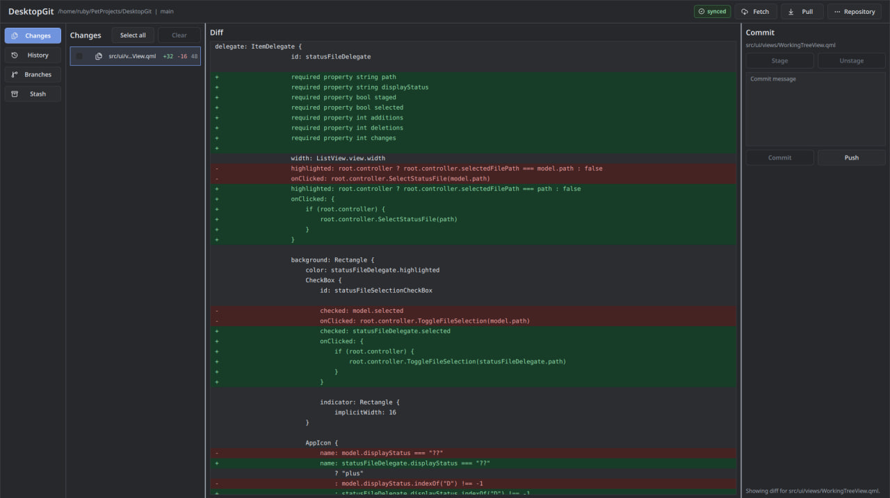
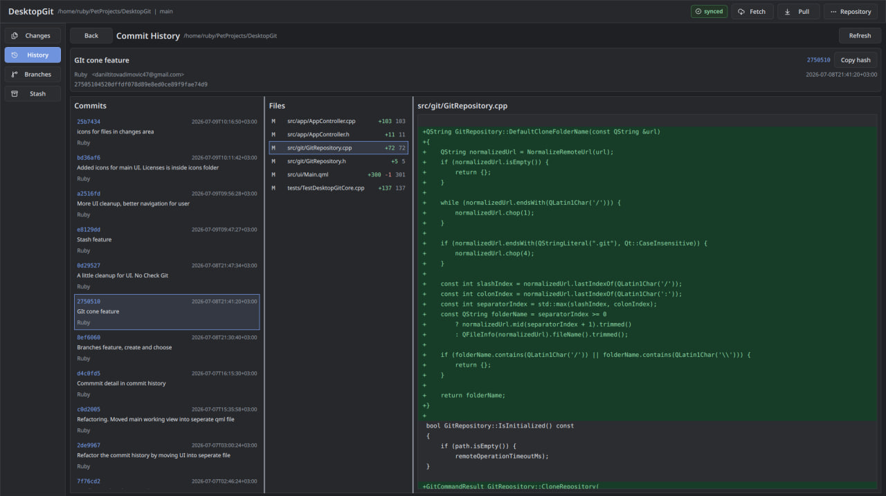

# DesktopGit

DesktopGit is a small desktop Git client built with C++ and Qt Quick.

The goal of this project is to make common Git actions easier to see and use from a clean GUI. The app works with local repositories and uses the system `git` command line tool under the hood.

## Tech Stack

- C++20
- Qt 6 / Qt Quick / QML
- Qt Quick Controls 2
- CMake
- Git CLI through `QProcess`
- Qt Test for core tests
- Lucide SVG icons

## Requirements

To build and use the project, you need:

- Qt 6.5 or newer
- CMake 3.21 or newer
- A C++20 compiler
- Git installed and available in `PATH`

For normal GitHub work, your system Git must already be configured. For example, SSH keys or HTTPS credentials should work in the terminal before using push, pull, fetch, or clone inside the app.

## Download

Prebuilt Linux AppImage builds are available on the Releases page.

Download these files into one folder:

- `DesktopGit-x86_64.AppImage`
- `install-linux.sh`
- `uninstall-linux.sh`
- `desktopgit.svg`

Then run:

```bash
chmod +x install-linux.sh
./install-linux.sh ./DesktopGit-x86_64.AppImage
```

## Features

- Open an existing local Git repository
- Initialize a local Git repository
- Connect a local repository to a remote URL
- Clone a repository into a selected folder
- View changed files
- View readable file diffs with added and removed lines
- Stage and unstage one or many files
- Select all changed files
- Create commits with a custom commit message
- Push commits to the remote repository
- Fetch and pull remote changes
- Show local branch state with ahead / behind information
- View local branches
- Create and switch branches
- View commit history
- View commit details, changed files, and commit diffs
- Use stash actions: push, apply, pop, and drop
- Dark UI with SVG icons

## Build

From the project root:

```bash
cmake -S . -B build
cmake --build build
```

## Run

```bash
./build/desktop_git
```

## Run Tests

```bash
ctest --test-dir build --output-on-failure
```

## Install AppImage Locally

After downloading the AppImage from GitHub Releases, you can add it to the application launcher:

```bash
./scripts/install-linux.sh ./DesktopGit-x86_64.AppImage
```

This installs the AppImage into `~/.local/bin`, adds the app icon, and creates a desktop launcher entry.

To remove it:

```bash
./scripts/uninstall-linux.sh
```

## Build AppImage

The AppImage build uses `linuxdeployqt`.

For a portable AppImage, build it on Ubuntu 22.04 or another system with `glibc` 2.35 or older. Newer systems may be rejected by `linuxdeployqt`, because the generated AppImage would not work on many older distributions.

You can download `linuxdeployqt` into the local `tools` folder:

```bash
./scripts/install-linuxdeployqt.sh
```

Then build the AppImage:

```bash
./scripts/build-appimage.sh
```

The generated `.AppImage` file can be uploaded to GitHub Releases.

## Create A GitHub Release

The repository has a GitHub Actions workflow that builds an AppImage when you push a version tag:

```bash
git tag v0.1.0
git push origin v0.1.0
```

GitHub Actions will build the AppImage on Ubuntu 22.04 and upload these release files:

- `DesktopGit-x86_64.AppImage`
- `install-linux.sh`
- `uninstall-linux.sh`
- `desktopgit.svg`

## Screenshots

### Changes And Diff



### Commit History



## Notes

This project does not use `libgit2`. It calls the installed `git` executable with `QProcess`. This keeps the project simpler and makes the behavior close to normal terminal Git.

Icons are stored in `assets/icons/lucide`. Their license information is in `assets/icons/LICENSES.md`.
